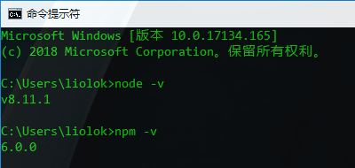
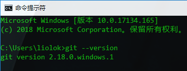
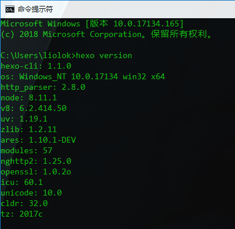
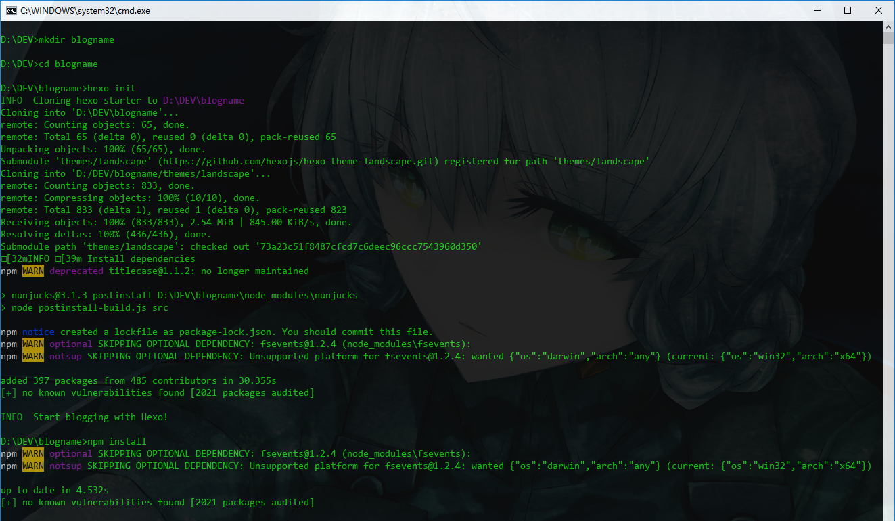
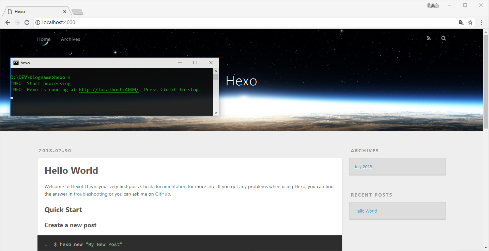
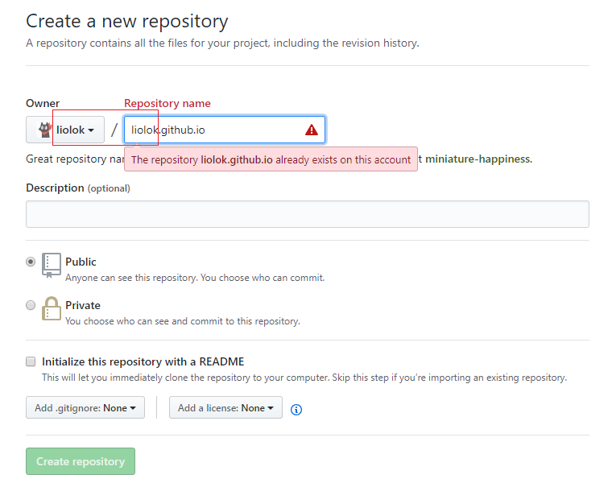
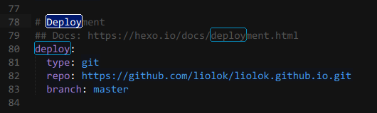

# 本地 - Hexo 博客框架

> Hexo [官方网站](https://hexo.io/zh-cn/)及[中文文档](https://hexo.io/zh-cn/docs/)

Hexo 是一个基于 **Node.js** 的博客框架. 在本文中, 我们会在本地维护一个 Hexo 博客站点, 并在需要发布时使用 **Git** 将其部署到 Github Pages.

## 配置环境

### Node.js

下载页面: [Download | Node.js](https://nodejs.org/en/download/)

安装完成后在命令提示符或终端模拟器中使用 `node -v` 验证 Node.js 环境配置, `npm -v` 验证其包管理器安装, 成功结果应如下图:



### Git

下载页面: [Git - Downloads](https://git-scm.com/downloads)

> Windows 平台的**未翻墙**用户如果下载过慢, 可以使用这个第三方资源: [Git for Windows 国内下载站](https://github.com/waylau/git-for-win#git-for-windows-%E5%9B%BD%E5%86%85%E4%B8%8B%E8%BD%BD%E7%AB%99), 同时建议通过各种途径随时访问**互联网**.

安装完成后在命令提示符或终端模拟器中使用 `git --version` 验证Git安装:



#### 配置用户信息

> 参考官方文档 [Git - 初次运行 Git 前的配置](https://git-scm.com/book/zh/v2/%E8%B5%B7%E6%AD%A5-%E5%88%9D%E6%AC%A1%E8%BF%90%E8%A1%8C-Git-%E5%89%8D%E7%9A%84%E9%85%8D%E7%BD%AE) 的`用户信息`章节.


```shell
git config --global user.name "名称"

git config --global user.email "邮箱"
```

> 注意此处的邮箱应与后面用于[创建博客专用仓库](#创建博客专用仓库)的 GitHub 账号注册邮箱一致.

## 安装 Hexo 框架

使用 `npm install -g hexo-cli` 来安装 Hexo 框架.

> 在 Windows 平台上可能会有如下两个警告, 提示可选依赖 `fsevent` 未安装, 因其所需的系统环境是 OS X. **忽略**即可, 其他绝大部分警告亦是如此, 不过仍需注意其含义.
> ```shell
npm WARN optional SKIPPING OPTIONAL DEPENDENCY: fsevents@1.1.3 (node_modules\hexo-cli\node_modules\fsevents):
 
npm WARN notsup SKIPPING OPTIONAL DEPENDENCY: Unsupported platform for fsevents@1.1.3: wanted {"os":"darwin","arch":"any"} (current: {"os":"  win32","arch":"x64"})
> ```

安装完成后使用 `hexo version` 验证安装:



## 创建博客站点

> 本节参考官方文档中的[建站](https://hexo.io/zh-cn/docs/setup.html)章节.

使用 `hexo init blogname` 创建博客, 其中 `blogname` 是博客名称, 也可以先创建子目录并在其中使用 `hexo init`, 结果是一样的. 下图中使用的是后一种方式:



> 上图中最后的 `npm install` 是用来安装 Node.js 依赖模块的, 可以看到除前面提到的非 Windows 平台可选依赖 `fsevent` 外均已安装并更新到最新.

目前为止我们得到了 `blogname` 这个目录, 它包含博客站点在本地的源文件, 是未发布的线下版本, 后续我们对博客站点及主题的配置, 撰写文章, 部署站点等一系列操作, 都是在这里进行的.

## 本地预览博客

> 本节参考官方文档中的[服务器](https://hexo.io/zh-cn/docs/server)章节.
> 
> > 经笔者测试发现官方文档中所需模块 `hexo-server` 已默认集成, **无需**另行安装.

在博客目录下使用 `hexo server` 或其简写 `hexo s` 启动本地服务器.

根据命令的回显, 访问 http://localhost:4000(如需自定义IP及端口, 请参考官方文档):



> 在管理博客的过程中, 本地预览将会是频繁进行的操作. 可以根据个人习惯对该操作进行简化, 如写成脚本或将预览网址设为书签等等.

上图中预览的是 Hexo 的默认博客站点, 这显然不是我们想要的. 从默认到个性化的两大方面:

- 依据个人喜好修改站点及主题的配置, 可以参考笔者的另一篇文章: [Hexo + NexT 博客定制](../Hexo-and-NexT);
- 持续为博客增加优质文章, 参考官方文档的[写作](https://hexo.io/zh-cn/docs/writing.html)及 [Front-matter](https://hexo.io/zh-cn/docs/front-matter) 这两个章节.

> 对于博文的写作, 还需要了解 [Markdown](https://zh.wikipedia.org/zh-hans/Markdown). 它是一门简单易上手的轻量级标记语言, 排版从未如此轻松; 语法请参考 [Mastering Markdown · GitHub Guides](https://guides.github.com/features/mastering-markdown/), 并在学习及使用过程中善用搜索引擎, 比如 [Markdown 表格 - Google 搜索](https://www.google.com/search?q=Markdown%20%E8%A1%A8%E6%A0%BC).

# 云端 - GitHub Pages

*GitHub Pages is a **static** site hosting service designed to host your personal, organization, or project pages directly from **a GitHub repository**.*

> 以上内容引自官方文档: [What is GitHub Pages? - User Documentation](https://help.github.com/articles/what-is-github-pages/)

简单说, GitHub Pages 是一个静态网站托管服务. 而 Hexo 就正是一个静态博客框架. ([静态意味着什么?](#静态博客-vs-动态博客))

目前为止, 我们已经在本地创建了一个 Hexo 博客. 现在我们只需要一个用来部署网站的代码仓库, 再进行适当的配置, 就可以把博客发布到线上了.

## 创建博客专用仓库

> 参见 GitHub Pages 官方文档中关于**用户主页站点**的仓库命名规则: [User, Organization, and Project Pages - User Documentation](https://help.github.com/articles/user-organization-and-project-pages/#user-and-organization-pages-sites)

用你的 [GitHub 账号](https://github.com/join)进行 [New repository](https://github.com/new) 操作, 详细配置如下, **替换** `liolok` 为你的用户名, 与左边的 `Owner` **一致**即可.



## 为博客添加部署插件

在博客所在目录下使用 `npm install hexo-deployer-git --save` 以安装通过 Git 部署站点所需模块.

## 修改博客的部署配置

> 参考官方文档中的[部署](https://hexo.io/zh-cn/docs/deployment.html)章节.

博客目录下的 `_config.yml` 是博客整体配置文件, 修改其中的 `deploy` 部分.

```yaml
deploy:
  type: git
  repo: https://github.com/你的用户名/你的用户名.github.io.git
  branch: master
```

如笔者的配置:



> 注意 YAML 语法缩进, 统一使用两个空格缩进表示层级关系, 冒号与参数间用一个空格隔开.

## 部署站点到代码仓库

在博客目录下使用 `hexo deploy -generate` 或其简写 `hexo d -g`, 让 Hexo 在生成静态站点文件后, 将其部署到代码仓库.


> 如上图所示, 在第一次部署时会弹出 GitHub 的身份验证, 登录即可.

稍等片刻, 访问 `https://你的用户名.github.io`, 博客应该已经呈现在眼前了.

# 博客搭建总结

## 博客 vs. 微博

在如今, 人们似乎更熟悉微博而不是博客. 也许那个全民自行发布内容时代已经过去了, 取而代之的是容量更小同时更注重社交性的微博.

笔者认为微博的内容过于碎片化, 无法像传统博客这样发布篇幅较长且良好排版的文章, 而这正是优质内容最好的发布方式.

> 值得注意的是: 与中国大陆不同, 在全世界范围内, 微博(Microblog)一词通常指 Twitter.

## 独立博客 vs. 博客平台

世界范围内的博客平台有很多, 最著名的的应该算 Google 的 Blogger, 笔者也尝试过, 印象是虽然简单易上手, 但在自定义和排版方面相比本文的方案还是要差一些, 尤其是对代码块的高亮样式等方面, 总之 Blogger 的原生设计给笔者一种不太适合代码相关的感觉. 不过相比之下更需要关心的是, 几乎所有国外的博客平台, 在不访问互联网的情况下, 都是访问不到的, 笔者不希望先天流失绝大多数用户, 同时也希望能有越来越多的读者访问更真实的互联网.

中国大陆现存的大大小小的博客平台, 笔者也见过不少, 常见的是 CSDN, 51CTO, 博客园(CNBlogs), 程序园, SegmentFault(思否)专栏, 知乎专栏, 简书等等. 以上平台要么页面风格老旧, 要么广告一堆, 笔者自认吹毛求疵, 恕难苟同"只要内容质量高, 发布平台难看一点/有点广告也可以接受"的观点. 诚然, 最后列出的三个平台相比之下风格新颖, 使用也方便, 但也可自定义程度和广告等问题仍然存在.

如果不希望花费时间精力搭建独立博客, **勉强**推荐 SegmentFault(思否)专栏, 知乎专栏, 简书这三个发布平台中做选择, 排名不分先后, 都差不多. 不过来都来了, 而且都看到这里了, 还是放手去做吧(笑).

## 静态博客 vs. 动态博客

前一节提到的博客平台显然都是动态博客, 不过自建独立博客是两者均可选择的, 大名鼎鼎的 WordPress 就是一个很多人都在用的动态博客程序. 那么相比于动态博客, 静态博客有哪些优劣呢?

### 优势

资源占用低, 访问速度快, 安全性较高.

通过使用如本文介绍的 GitHub Pages 等托管服务, 如果自定义域名没有需求, 可以做到免费搭建.

> 如需自定义域名可以参考官方文档: [Using a custom domain with GitHub Pages - User Documentation](https://help.github.com/articles/using-a-custom-domain-with-github-pages/)

### 劣势

#### 评论系统

由于没有数据库(这一点同时也使得静态博客访问速度更快), 静态博客不支持用户登录, 没有内置的评论系统.

这里只给出笔者所知的两方面解决方案, 也欢迎热心读者补充:

- 使用第三方评论服务, 比如 [Disqus](https://disqus.com/): 支持各种社交平台账号登录, 也支持匿名评论(需填写联系邮箱), 不过不支持使用 Markdown, 笔者也因此选择了下面的方案;
- 对于使用 GitHub Pages 的方案, 完全可以就地使用 repo 的 issues 实现评论系统. 现有的 Hexo 插件有两款: [Gitment](https://github.com/imsun/gitment) 和 [Gitalk](https://github.com/gitalk/gitalk), 前者有一定问题且已停更, 本博客正在使用后者, 参考另一篇文章: [Hexo + Gitalk 评论系统](../Hexo-and-Gitalk).

## 关于折腾

从零开始搭建本文的博客, 再加上后面的定制和管理, 花费了笔者不少的时间和精力, 而这些工作确实不能算在后续的内容产出范畴内, 也许是"瞎折腾"吧. 但是这个折腾的过程也让笔者接触了几个新的领域, 补充了很多新知识, get到了一些新技能, 并不是做了无用功. 推荐阅读: [聊聊【折腾】的重要性 @ 编程随想的博客](https://program-think.blogspot.com/2017/04/The-Importance-of-Zheteng.html)

## 写在最后

前面也反复提到过"内容产出"和"内容质量"等概念, 说白了就是多写文章, 写好文章. 本文只是以一种方案进行了搭建, 想要真正做好一个博客还远远不够, 笔者在此也给自己立一个 flag: 坚持写作并为博客持续添加高质量文章.
