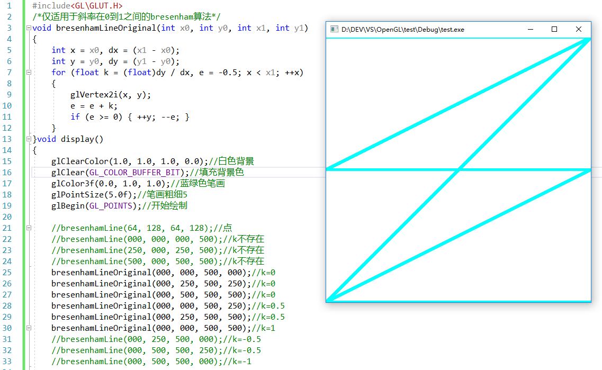
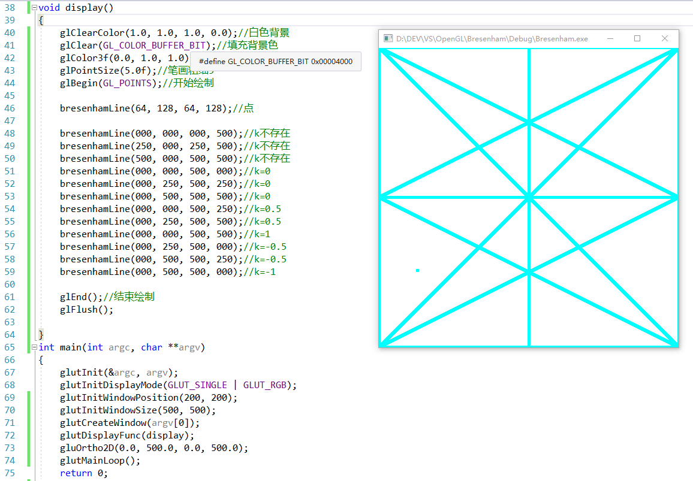

## 简单版本

[教材](https://book.douban.com/subject/3629471/) P17 简单版本的 Bresenham 直线算法的 C++ 代码如下：

```cpp
/* 简单版本的 Bresenham 算法核心代码 */
void bresenhamLineOriginal(int x0, int y0, int x1, int y1)
{
    int x = x0, dx = (x1 - x0);
    int y = y0, dy = (y1 - y0);
    for (float k = (float)dy / dx, e = -0.5; x < x1; ++x)
    {
        glVertex2i(x, y);
        e = e + k;
        if (e >= 0) { ++y; --e; }
    }
}
```

测试数据及效果图如下：



<!-- more -->

## 推广算法

从上图及其测试数据可以看出，简单形式的 Bresenham 直线算法仅支持斜率区间为`[0,1]`的直线，而且还有`x0 <= x2`这样一个隐含条件。
如何推广到任意直线，下面简单说一下：

- 去掉`x0 <= x2`隐含条件，只需要将横坐标的原步长`1`加上`x1-x0`的符号即可；
- 把斜率区间`[0,1]`推广到`[-1,1]`，只需要将纵坐标的原步长`1`加上`y1-y0`的符号即可；
- 把斜率区间从`[-1,1]`推广到任意，只需要在斜率绝对值大于`1`时变换横纵坐标轴即可。

代码如下：

```cpp
#include<GL\GLUT.H>

/* 求绝对值 */
inline int abs(int a) { return (a < 0 ? -a : a); }

/* 取符号，正为1，负为-1，零为0 */
inline int sign(int a) { return ((a > 0) ? 1 : (a < 0 ? -1 : 0)); }

/* 交换数值 */
inline void swap(int &a, int &b) { int temp = a; a = b; b = temp; }

/* Bresenham 画线，起点为(x0,y0)，终点为(x1,y1) */
void BresenhamLine(int x0, int y0, int x1, int y1)
{
    enum { X, Y, XY }; // 枚举 0，1，2，提高可读性

    /* XY 坐标距离 distance，用于更新决策参数 dp */
    int d[XY] = { abs(x1 - x0), abs(y1 - y0) };

    /* XY 坐标差符号 sign，用于更新坐标光标 cur */
    int s[XY] = { sign(x1 - x0), sign(y1 - y0) };

    /* 考虑是否变换坐标轴，以处理斜率绝对值大于 1 的直线 */
    bool flag = (d[X] < d[Y]); // 斜率绝对值大于 1 则需要变换
    if (flag) swap(d[X], d[Y]); // 需要变换则交换 XY 轴坐标距离

    int cur[XY] = { x0, y0 }; // cursor，坐标光标，初始化为起点
    int dp = 2 * d[Y] - d[X]; // decision parameter，决策参数
    for (int i = 0; i <= d[X]; ++i)  // 光标遍历，逐个画点
    {
        glVertex2i(cur[X], cur[Y]);
        if (dp >= 0)  // 判断决策参数
        {
            cur[!flag] += s[!flag]; // 若未变换，更新纵坐标
            dp -= 2 * d[X]; // 修正决策参数
        }
        cur[flag] += s[flag]; // 若未变换，更新横坐标
        dp += 2 * d[Y]; // 更新决策参数
    }
}

void display()
{
    glClearColor(1.0, 1.0, 1.0, 0.0); // 白色背景
    glClear(GL_COLOR_BUFFER_BIT); // 填充背景色
    glColor3f(0.0, 1.0, 1.0); // 蓝绿色笔画
    glPointSize(5.0f); // 笔画粗细
    glBegin(GL_POINTS); // 开始绘制

    BresenhamLine(64, 128, 64, 128); // 点

    BresenhamLine(000, 000, 000, 500); // k 不存在
    BresenhamLine(250, 000, 250, 500); // k 不存在
    BresenhamLine(500, 000, 500, 500); // k 不存在
    BresenhamLine(000, 000, 500, 000); // k = 0
    BresenhamLine(000, 250, 500, 250); // k = 0
    BresenhamLine(000, 500, 500, 500); // k = 0
    BresenhamLine(000, 000, 500, 250); // k = 0.5
    BresenhamLine(000, 250, 500, 500); // k = 0.5
    BresenhamLine(000, 000, 500, 500); // k = 1
    BresenhamLine(000, 250, 500, 000); // k = -0.5
    BresenhamLine(000, 500, 500, 250); // k = -0.5
    BresenhamLine(000, 500, 500, 000); // k = -1

    glEnd(); // 结束绘制
    glFlush();
}

int main(int argc, char **argv)
{
    glutInit(&argc, argv);
    glutInitDisplayMode(GLUT_SINGLE | GLUT_RGB);
    glutInitWindowPosition(200, 200);
    glutInitWindowSize(500, 500);
    glutCreateWindow(argv[0]);
    glutDisplayFunc(display);
    gluOrtho2D(0.0, 500.0, 0.0, 500.0);
    glutMainLoop();
    return 0;
}
```

测试数据及效果图如下：



## 决策参数

但是从简单到复杂的过程中还有一个变化是我不太理解的，那就是决策参数`dp`(也就是原代码中的`e`)。初始值从`-0.5`改为`2 * d[Y] - d[X]`，步长从斜率`k`改为`2 * d[Y]`，大于零时的修正值从`-1`改为`2 * d[X]`。这是为什么呢。

<!-- TODO：整理该翻译及个人总结 -->

------

以下是解答部分：

[opengl - Bresenham line algorithm - where does the decision parameter come from? - Stack Overflow](https://stackoverflow.com/questions/19188319/Bresenham-line-algorithm-where-does-the-decision-parameter-come-from)

以下是原答案的个人翻译：

Bresenham 算法只进行整数运算。主要思想在于尽量减少直线方程增量估值的计算。

该算法非常简单。我们从直线方程入手：`f(x) = y = a*x +b`(目前假设`0 <= a < 1`)。

当我们向右移一个像素时，我们得到：`f(x+1) = a * (x+1) + b = f(x) + a`。

但是对于一般的直线来讲，`a`和`y`都不会是整数。所以我们不妨引入一个"误差"。我们一直沿x轴向右移动。在这个过程中，我们初始化误差`e`为`a`并以`a`步进，用于决定每右移一个像素后，是否要上移一个像素。如果我们的误差高于0.5个像素(条件)，那就沿y轴上移一个像素，此后再将误差值减小1个像素(修正值)。代码如下：

```cpp
float e=a;
float y=y1;
int x=x1;
while(x<=x2) {
    SetPixel(x,y);
    x++;
    if (e > 0.5) {
        y++;
        e=e+a-1;
    }
    else {
        e=e+a;
    }
}
```

（请注意，我们将误差`e`初始化为`a`而不是`0`，因为我们在绘制像素之后才做出决定，并且在绘制第一个像素之前并不需要检验`e > 0.5`这一条件，因为起点总是恰好在直线上。）

现在，我们已经更进一步了。但仍有两点有悖于整数运算：`0.5`，还有`a`（也就是`dy/dx`）。但是：我们能够以任意比例缩放误差的步长（还有条件），且并不会影响结果。想想看：目前为止我们以1像素为单位修正误差（因为起初这很直观），但是这个算法可以使用任意值来修正误差——半个像素、两个像素、π 个像素。

因此，我们只需将初始值及步长`a`缩放为`2*dy`，条件`0.5`缩放为`dx`，修正值1缩放为`2*dx`即可摆脱上面的两个分数!（从某种意义上说，此处的关键在于我们使用的不是算法中的常数，而是直线的导出函数）。代码如下：

```cpp
int e=2*dy;
int y=y1;
int x=x1;
while(x<=x2) {
    SetPixel(x,y);
    x++;
    if (e > dx) {
        y++;
        e=e+2*dy - 2*dx;
    }
    else {
        e=e+2*dy;
    }
}
```

现在，我们的目的达成了：只有整数参与运算。（这里需要注意的一点是：从`float`改用`int`的同时，直线的端点自动折合成了整数坐标——整数端点是 Bresenham 算法的先决条件，同时也是其局限性）。

此外，还有一个缺陷：条件含有变量。如果以一个常量作为条件进行对比，计算会更加高效，而最理想的条件是常量0，因为依赖符号/零标志的判断分支节省了比较操作。我们可以通过改变误差的修正值来实现这一点。同理，不仅修正值的缩放比例可以任意选择，误差的初始值也可以。下面我们来看看如何修改初始值以使条件变为常量0:

我们的条件目前是`e > dx`，因此将误差初始值偏移`-dx`将使我们能够对`0`进行比较(现在`0`表示`dx`之前的含义，即0.5像素)。这个偏移只会影响`e`的初始值和条件，并且条件中所有的步长都和以前一样:

```cpp
int e=2*dy-dx;
int y=y1;
int x=x1;
while(x<=x2) {
    SetPixel(x,y);
    x++;
    if (e > 0) {
        y++;
        e=e+2*dy - 2*dx;
    }
    else {
        e=e+2*dy;
    }
}
```
看，`2*dy-dx`就这样出现了。

------

<!-- END TODO -->

## 参考文章

测试数据：https://blog.csdn.net/demonliuhui/article/details/52985949

推广算法：[Generalized Bresenham's Line Drawing Algorithm using OpenGL](https://code-blocks.blogspot.hk/2014/12/generalized-bresenhams-line-drawing.html)
