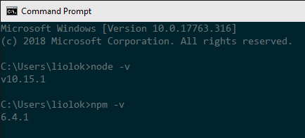
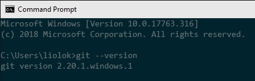
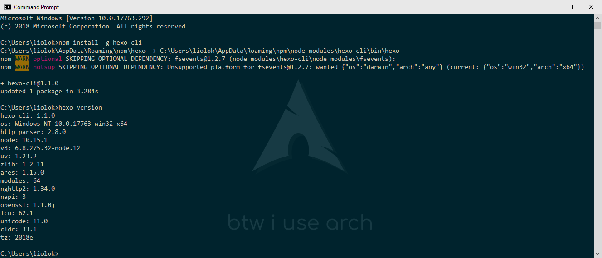
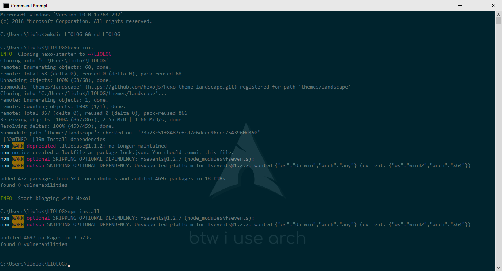
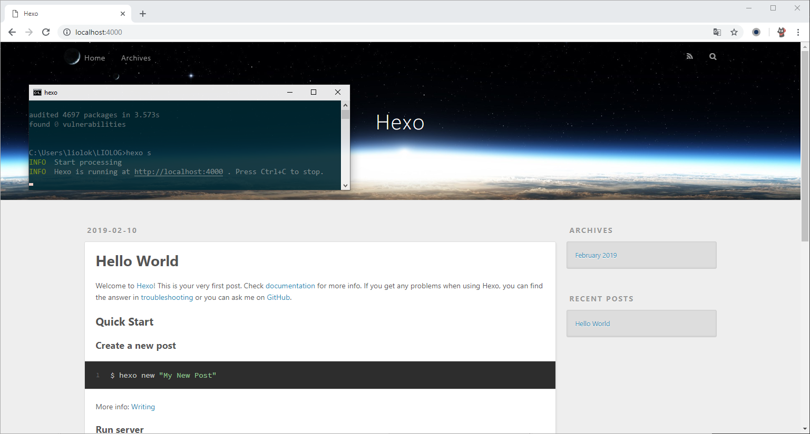
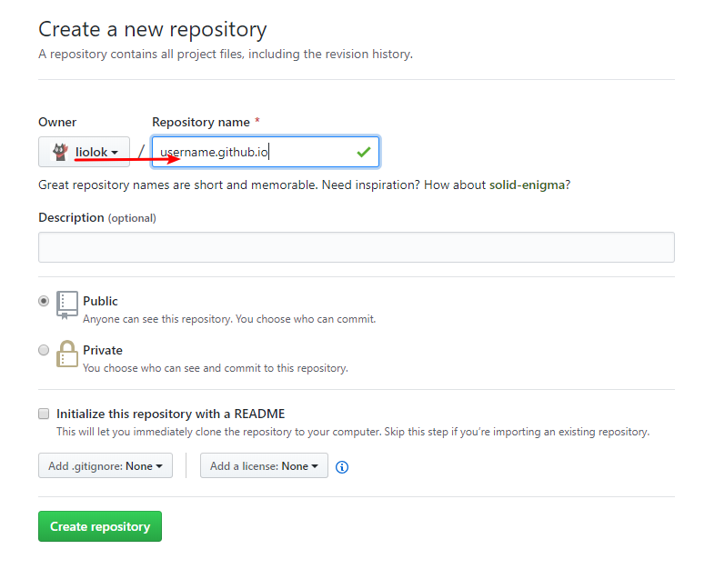

# Local - Hexo Site

> Reference: [Hexo](https://hexo.io/) and its [documentation](https://hexo.io/docs/).

Hexo is a blog framework based on **Node.js**. In this article, we will initialize a Hexo site on local disk, and talk about how to publish it to GitHub Pages, which would use **Git** indirectly.

<!-- more -->

## Prepare Environment

On Arch Linux, you need just one command to do all the work below with your favorite AUR helper:

```shell
$ yay -Syu nodejs-hexo-cli git
```

Then you can skip to [initialize site](#Initialize-Hexo-Site) step.

Yes this is showing off, it's not that simple on most of other platforms.

### Node.js

Go to [Download | Node.js](https://nodejs.org/en/download/), choose and install the latest 64-bit LTS version.

After installation, run `node -v` and `npm -v` to verify both Node.js enviornment and its package manager:



### Git

Click this [official link](https://git-scm.com/download/win) to download and install. VS Code is recommended for default editor, leave other options default if you don't understand, all these stuff could be configured when needed later.

Run `git --version` to verify installation:



Then config the user name and email, the latter should be the same as your [GitHub commit email](https://help.github.com/articles/about-commit-email-addresses/).

```shell
$ git config --global user.name "Your Name"
$ git config --global user.email your.mail@example.com
```

### Hexo

Run `npm i -g hexo-cli` and `hexo version` to install and verify Hexo.

> There may be two warnings like below, saying that an **optional** dependency named `fsevent` was skipped since it's macOS only (npm, you have to say, huh?). We can just **ignore** this.



## Initialize Hexo Site

Change to your prefered directory, and run `hexo init name` (use your prefered name) and `npm install` to establish site and update dependencies. You can also make an empty subdirectory and run `hexo init` and `npm install` in it, I applied this method below:



Now we got a local folder containing a default blog's source. I wrote another article for modifiying it, check it out in my [Hexo posts](/tags/Hexo).

## Preview Blog

In site directory run `hexo server` or its abbreviation `hexo s` to start the local server. You can also run `hexo s -i 192.168.*.*` (use your PC's LAN IP) if want to preview on other devices in LAN like phones. If you want to change the port or if you’re encountering `EADDRINUSE` errors, use the `-p` option to set a different port.

According to output, visit `http://localhost:4000`:



Preview operating would be frequent when managing blog, you may consider to write a script to save time.

# Online - GitHub Pages

[What is GitHub Pages?](https://help.github.com/articles/what-is-github-pages/) —— *GitHub Pages is a **static** site hosting service designed to host your personal，organization，or project pages directly from **a GitHub repository**.*

Of course Hexo is a static blog framework and we already have a Hexo site on local disk, now we got to create a particular repository and configure a bit more, soon we'll arrive at "*username*.github.io" online.

## Create Dedicated Repository

> Repository naming scheme refers to [User and Organization Pages sites](https://help.github.com/articles/user-organization-and-project-pages/#user-and-organization-pages-sites).

[Create a new repository](https://github.com/new) like below, **replace** `username` with your own (**same** as `Owner` on the left).



## Publish Blog Online

> **This chapter is left for reference only**: I'm managing blog in a better workflow, including auto deployment and more, check out other [Hexo posts](/tags/Hexo).

Reference: [Deployment | Hexo](https://hexo.io/docs/deployment.html#Git)

### Install Deployer Plugin

Run `npm i --save hexo-deployer-git` in site folder.

### Deployment Configuration

Open site configuration file `_config.yml`, find `deploy:` part and edit:

```yml
deploy:
  type: git
  repo: https://github.com/username/username.github.io  # use your own username
  branch: master
```

> Pay attention to syntax of YAML: the colon must be followed by a space.

### First Deployment

In site folder run `hexo deploy --generate` or its abbreviation `hexo d -g`, this let Hexo deploy blog to repository after generating the static files.


> GitHub would verify your identity at first time as above, just login.

Quite soon the blog should be here: https://*username*.github.io.
