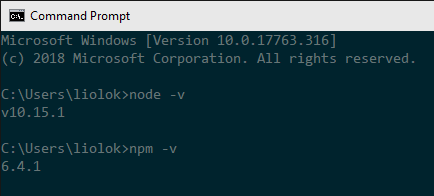
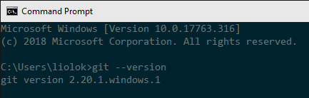
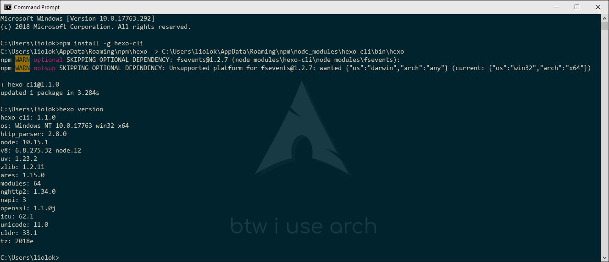
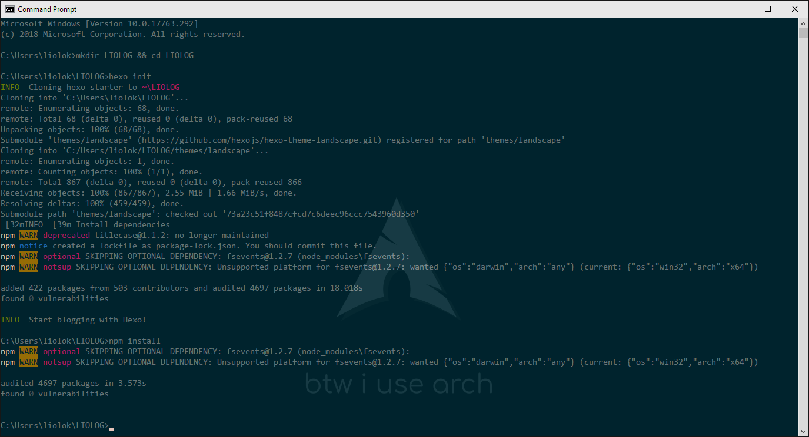
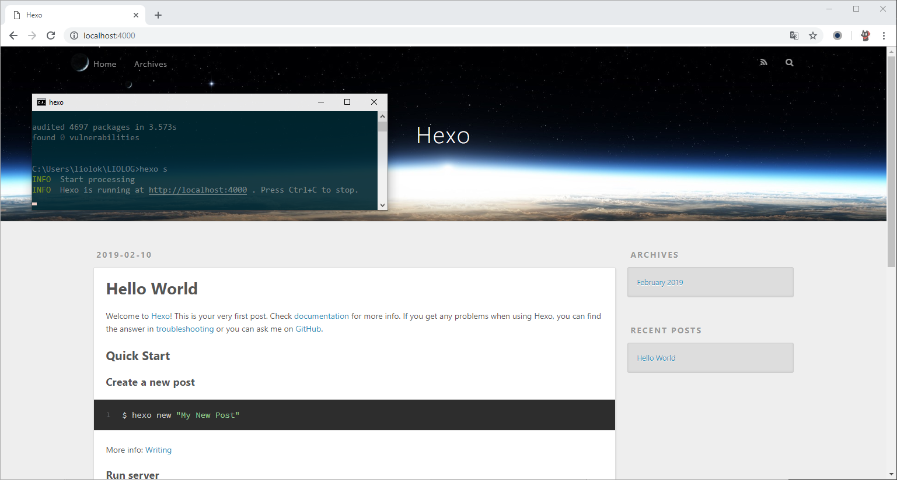
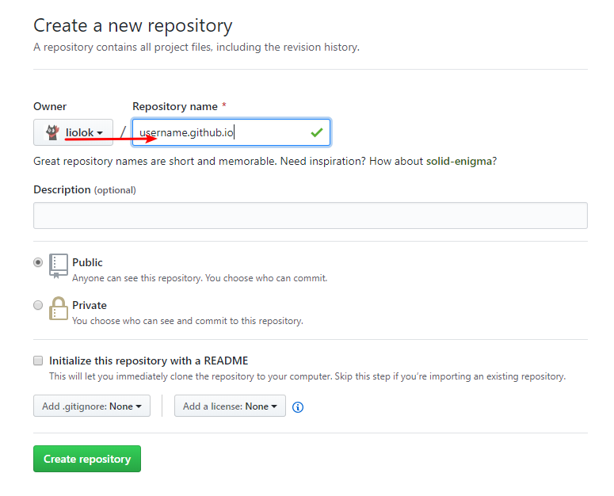
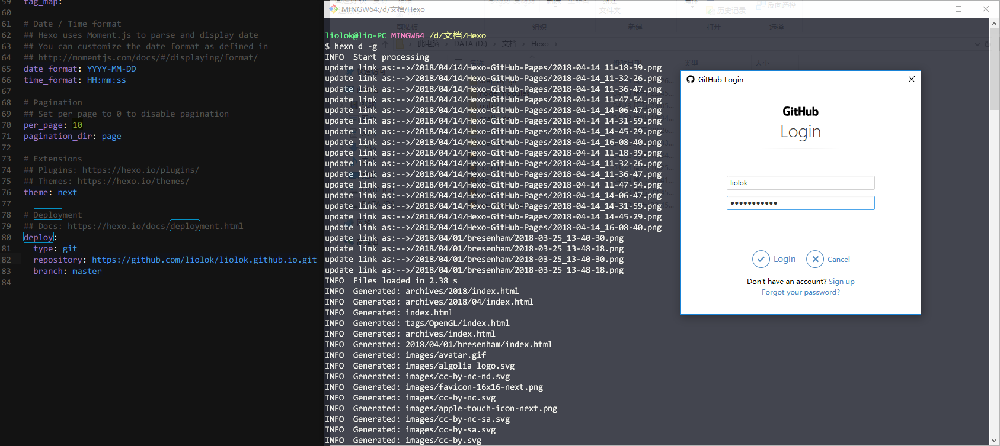

# 本地 - Hexo 站点

> Hexo [官方网站](https://hexo.io/zh-cn/)及[中文文档](https://hexo.io/zh-cn/docs/)

Hexo 是一个基于 **Node.js** 的博客框架。在本文中，我们会在本地维护一个 Hexo 博客站点，并在需要发布时将其部署到 Github Pages（这会用到 **Git**）。

<!-- more -->

## 配置环境

在 Arch Linux 上，只需一行命令即可做到本节下文所有事情（需要已装好一款 AUR helper）:

```shell
$ yay -Syu nodejs-hexo-cli git
```

然后就可以直接跳到[创建站点](#创建站点)步骤。


### Node.js

在[下载页面](https://nodejs.org/en/download/)选择并安装最新的 64 位 LTS 版本。

安装完成后在命令提示符中使用 `node -v` 和 `npm -v` 验证 Node.js 环境及其包管理器：



### Git

下载页面：[Git - Downloads](https://git-scm.com/downloads)

> Windows 平台用户如果下载过慢，可以使用这个第三方资源：[Git for Windows 国内下载站](https://github.com/waylau/git-for-win#git-for-windows-国内下载站)。

安装完成后在命令提示符中使用 `git --version` 验证安装：



配置用户信息，注意此处的邮箱应与你的 [GitHub commit email](https://help.github.com/articles/about-commit-email-addresses/) 一致。

```shell
git config --global user.name "用户名"
git config --global user.email "邮箱"
```

## 安装 Hexo

使用 `npm i -g hexo-cli` 和 `hexo version` 安装并验证 Hexo 框架。

> 在 Windows/Linux 平台上可能会有如下两个警告，提示已跳过可选依赖 `fsevent`，因其仅支持 macOS（那 npm 你还非得说）。**忽略**即可。



## 创建站点

在合适的目录下使用 `hexo init name`（自定义 name）和 `npm install` 创建博客站点并更新依赖。也可以先创建子目录并在其中使用 `hexo init` 和 `npm install`。下图中使用的是后一种方式：



现在我们得到的本地目录包含着一份默认的博客源码。关于如何私人定制，详见 [Hexo 相关文章](/tags/Hexo)。

## 预览博客

> 本节参考官方文档中的[服务器](https://hexo.io/zh-cn/docs/server)章节。（经笔者测试发现官方文档中所需模块 `hexo-server` 已默认集成，**无需**另行安装。）

在博客目录下使用 `hexo server` 或其简写 `hexo s` 启动本地服务器。如需实现在同一局域网下的其他设备如手机上也能预览，可以使用 `hexo s -i 192.168.*.*`，其中 `192.168.*.*` 为电脑的局域网 IP。

根据命令的回显，访问 `http://localhost:4000`：



在管理博客的过程中，本地预览将会是频繁进行的操作。可以考虑写个脚本来节省时间。

# 云端 - GitHub Pages

[What is GitHub Pages?](https://help.github.com/articles/what-is-github-pages/) —— *GitHub Pages is a **static** site hosting service designed to host your personal，organization，or project pages directly from **a GitHub repository**.*

简单的说，GitHub Pages 是一个静态网站托管服务。而 Hexo 就正是一个静态博客框架。目前为止，我们已经在本地创建了一个 Hexo 站点。现在我们只需要一个用来部署网站的代码仓库，再进行适当的配置，就可以把博客发布到线上了。

## 创建专用仓库

> 仓库命名规则参考：[User and Organization Pages sites](https://help.github.com/articles/user-organization-and-project-pages/#user-and-organization-pages-sites)

[创建仓库](https://github.com/new)，**替换** `username` 为你的用户名（即与左边的 `Owner` **一致**）。



## 发布博客

> **本章节以下内容仅留作参考**：笔者正在使用一种更为先进的方式进行博客管理，其中就包括自动化部署，详见 [Hexo 相关文章](/tags/Hexo)。

参考官方文档中的[部署](https://hexo.io/zh-cn/docs/deployment#Git)章节。

### 安装部署插件

在博客目录下运行 `npm i --save hexo-deployer-git`。

### 部署配置

博客目录下的 `_config.yml` 是博客站点配置文件，定位到 `deploy` 部分并作如下修改：

```yml
deploy:
  type: git
  repo: https://github.com/你的用户名/你的用户名.github.io
  branch: master
```

> 注意 YAML 语法，冒号与参数间用空格隔开。

### 首次部署

在博客目录下运行 `hexo deploy --generate` 或其简写 `hexo d -g`，让 Hexo 在生成静态网站后，将其部署到仓库。



> 如上图所示，在第一次部署时会弹出 GitHub 的身份验证，登录即可。

稍等片刻，访问 `https://你的用户名.github.io`，博客应该已经呈现在眼前了。
