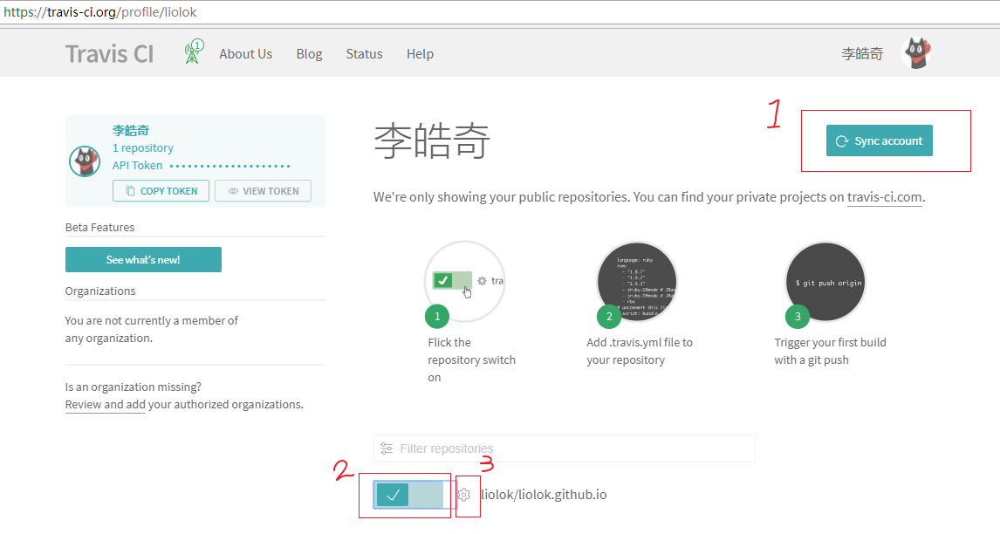
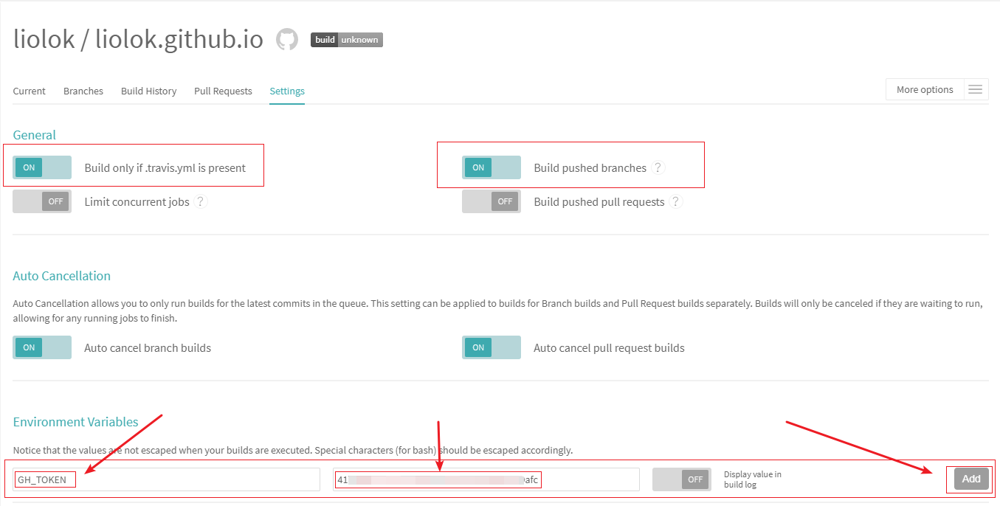

# 博客的版本控制

## 疑惑

<center>[博客搭建](https://liolok.github.io/2018/04/14/Hexo-GitHub-Pages/)一文中, 本地跟云端到底都存了些啥?</center>

- 本地是完整的博客实例, 里面有我们写的md格式的文章, 有文章引用的资源比如图片, 还有我们对博客以及主题的各种配置文件.
- 云端的GitHub Pages对应的是个人主页专用版本库(repository), 默认分支master里面是托管的静态网站文件, html的, css的, 最终上线的博客就是由这些文件所构成.

按照之前搭建的流程, 我们在本地目录创建一个Hexo框架的博客实例, 然后进行配置与写作, 本地预览调试觉得没问题可以上线博客了, 再将博客生成静态网站文件并部署到GitHub的repo上. 不出意外的话, 很快就能看到网站已经可以访问了.

用了半个月发现这个流程确实有问题, 这就涉及到Git的本质 ---- 版本控制. 通过每次commit及其message, 我们可以看到博客的变迁过程, 也可以在出了错误的时候吃一吃后悔药, 这些都是版本控制的效果.

我想那肯定要好好利用啊, 正好学习学习Git以及GitHub的基本操作.

结果我更迷茫了. 每次对博客做了改动, 小心翼翼的`hexo d -g -m "这是一点微小的更新说明blabla"`, 然后在repo的commits记录里查看时, 却发现在文件上根本看不到自己的改动, 出现在眼前的是经由hexo渲染生成的html和css, 我也看不懂啊, 这就好比我写了C的代码, 提交上去之后想看看代码变化, 却发现全是汇编甚至机器码, 这就很尴尬.

## 答案

答案就是, 生成的静态站点文件什么的, 就乖乖放在repo的master分支好了, GitHub Pages会帮你把后面的事情做好. 而版本控制的对象, 不应该是master分支里的静态站点, 而是博客实例.

创建博客源码分支source, 将本地的博客实例push上去.

未完待续.

# 配置Travis-CI






博客实例根目录下我所使用的.travis.yml配置:

```YAML
language: node_js  #设置语言

node_js: stable  #设置相应的版本

# 开始构建
before_install:
  - export TZ='Asia/Shanghai'  #统一构建环境和博客配置的时区, 防止文章时间错误
  
install:
  - npm install  #配置Hexo环境

script:
  - hexo cl  #清除
  - hexo g  #生成

after_script:
  - cd ./public
  - git init
  - git config user.name "your-username"  #用户名
  - git config user.email "your-email"  #邮箱
  - git add .
  - git commit -m "Site deployed by Travis CI"  #提交Commit时的说明
  - git push --force --quiet "https://${GH_TOKEN}@${GH_REF}" master:master  #GH_TOKEN是在Travis中配置Token的名称
# 结束构建

branches:
  only:
    - source  #只监测master之外新增的source即博客源码分支
env:
 global:
   - GH_REF: github.com/username/username.github.io.git  #设置GH_REF

cache:
  directories:  #缓存特定目录, 加快构建速度
    - node_modules

```

