# 系统环境

Manjaro Gnome over VMware Workstation, 虚拟机配置详见这篇文章: [Linux 系统及虚拟机新手指南](https://liolok.github.io/Linux-and-VM).

# 内核编译

> 本章节参考这篇 ArchWiki: [Kernels/Traditional compilation - ArchWiki](https://wiki.archlinux.org/index.php/Kernels/Traditional_compilation)

## 安装核心工具

```bash
$ sudo pacman -S base-devel # ensure the development tools are installed
```

## 创建构建目录

创建一个目录用来存放内核源码归档并在子目录下进行编译及构建.

笔者使用的内核构建目录是 `~/KernelBuild`, 其中"~"表示用户主目录 `/home/username`.

```shell
$ mkdir ~/KernelBuild && cd ~/KernelBuild # make and change to the directory
```

> 为什么不用 `/user/src` (`/usr/src/linux`):
> 
> 这个目录确实应用来存放各种源码, 但应仅用作参考(reference), 而不应进行编译构建.
> 
> Linux 文件系统层次结构标准: [4.12. /usr/src : Source code (optional)](https://refspecs.linuxfoundation.org/FHS_3.0/fhs/ch04s12.html), [中文文档](https://wylmer.gitbooks.io/filesystem-hierarchy-standard/content/4-usr-directory/12-usr-src.html).

## 下载解压归档

Linux 内核官方网站: The Linux Kernel Archives(https://www.kernel.org/)

下载和解压可以很简单, 直接使用各大发行版自带的 Firefox 等浏览器访问网站, 后面的事情只用鼠标全都能顺利完成. 

但如果想要硬核一点, 方法其实也有很多. 下面给出一种简单的在终端下使用 `wget` 从网站获取下载链接并进行下载和解压的方法(注意此时终端应工作在内核构建目录下): 

```shell
$ sudo pacman -S wget # ensure wget package is installed
$ wget https://www.kernel.org/ -O www-kernel-org.html # get website's source code
$ gedit www-kernel-org.html # get download link with editor, see screenshot below.
```

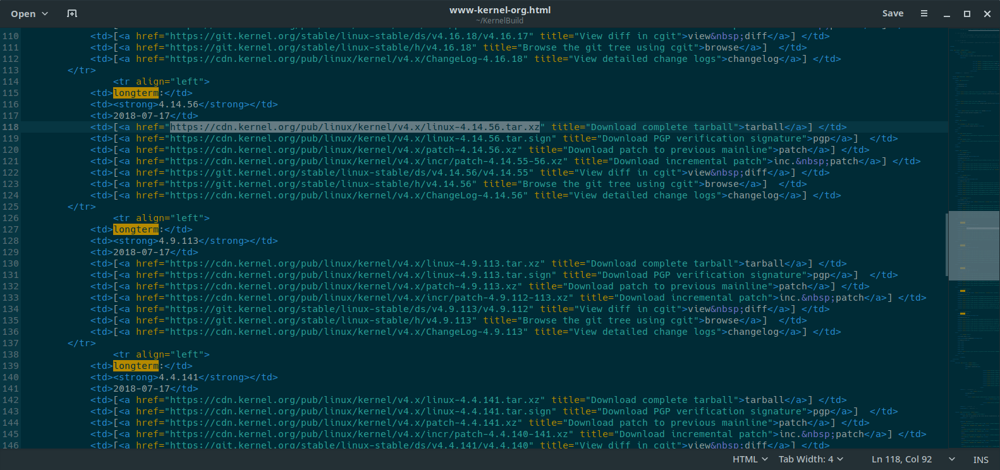
<center>从网站源码获取下载链接</center>

> 建议选择较新的长期支持版(longterm)归档压缩包, 以在后续步骤中使用更新的特性, 笔者选择的是届时最新的 `4.14.56`.

```shell
$ wget https://cdn.kernel.org/pub/linux/kernel/v4.x/linux-4.14.56.tar.xz # tarball
$ wget https://cdn.kernel.org/pub/linux/kernel/v4.x/linux-4.14.56.tar.sign # pgp
$ unxz linux-4.14.56.tar.xz # uncompress tarball to get the .tar archive
```

## 校验内核签名

> 此处步骤参考 Linux 内核官方文档: [Using GnuPG to verify kernel signatures](https://www.kernel.org/signature.html#using-gnupg-to-verify-kernel-signatures).

下载完成后, 应为归档验证签名, 而不是指望下载工具和网络传输等各方面因素的可靠性.

```shell
$ gpg2 --verify linux-4.14.56.tar.sign # verify the .tar archive against the signature
gpg: assuming signed data in 'linux-4.14.56.tar'
gpg: Signature made Tue 17 Jul 2018 05:39:53 PM CST
gpg:                using RSA key 647F28654894E3BD457199BE38DBBDC86092693E
gpg: Can't check signature: No public key
```

如果得到上面的 `No public key` 报错, 则需要下载导入公匙, 并使用 TOFU 信任模式:

```shell
$ gpg2 --locate-keys torvalds@kernel.org gregkh@kernel.org # download and import keys
$ gpg2 --tofu-policy good 647F28654894E3BD457199BE38DBBDC86092693E # trust the key 
$ gpg2 --trust-model tofu --verify linux-4.14.56.tar.sign # try again using TOFU
gpg: assuming signed data in 'linux-4.14.56.tar'
gpg: Signature made Tue 17 Jul 2018 05:39:53 PM CST
gpg:                using RSA key 647F28654894E3BD457199BE38DBBDC86092693E
gpg: Good signature from "Greg Kroah-Hartman <gregkh@kernel.org>" [full]
gpg: gregkh@kernel.org: Verified 1 signature in the past 8 days.  Encrypted 0
     messages.
```

> 通过 `--trust-model tofu` 选项, TOFU 信任模式已经被设为默认, 将来的校验均可通过最开始给出的 `gpg2 --verify` 进行.

## 解包内核源码

前面已经将 .xz 解压得到 .tar 并进行了签名校验, 现在只需使用 `tar` 将其解包到同名子目录即可得到内核的源代码:

```shell
$ tar -xvf linux-4.14.56.tar # unpack kernel source code
$ cd linux-4.14.56 # enter the source code subdirectory
```

## 清理编译历史

每次编译前, 都要确保目录下的编译历史已被清理干净, 同样也不要指望刚解包得到的源码目录就一定是干净的.

```shell
$ make mrproper # ensure the kernel tree is absolutely clean
```

## 导入默认配置并修改 Local version

```shell
$ zcat /proc/config.gz > .config # use default Arch configuration
$ make nconfig # rename your kernel version "CONFIG_LOCALVERSION"
```

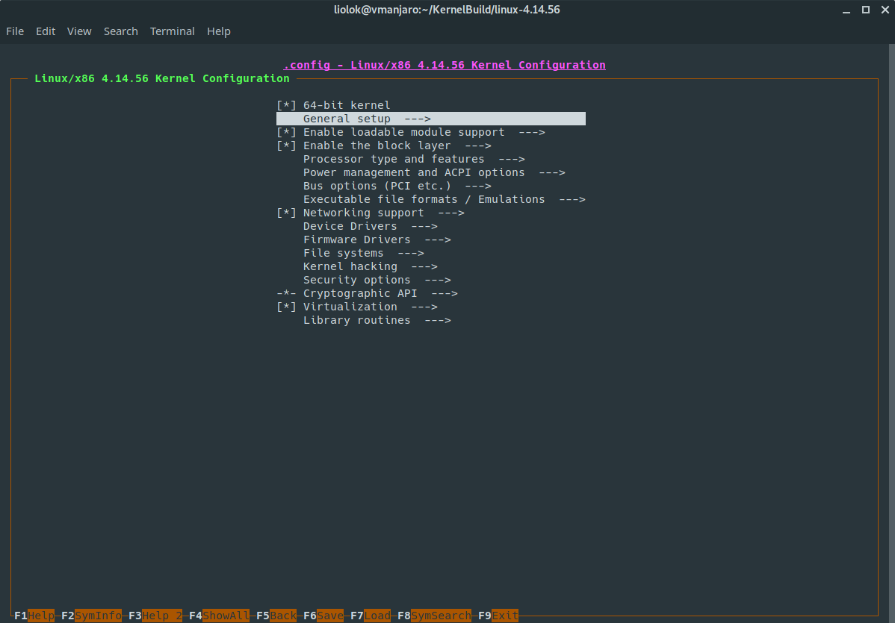
<center>上图: 进入一般设置</center>

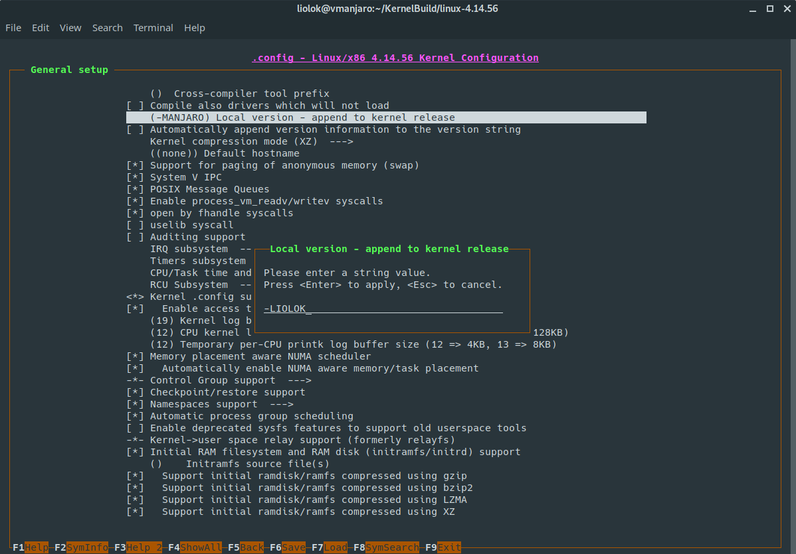
<center>上图: 修改 Local version</center>

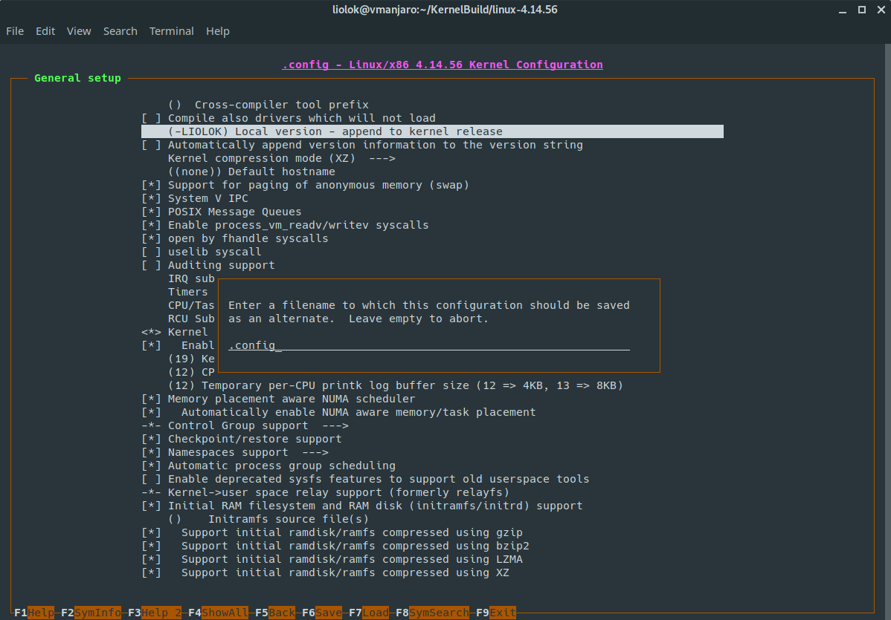
<center>上图: 保存内核配置</center>

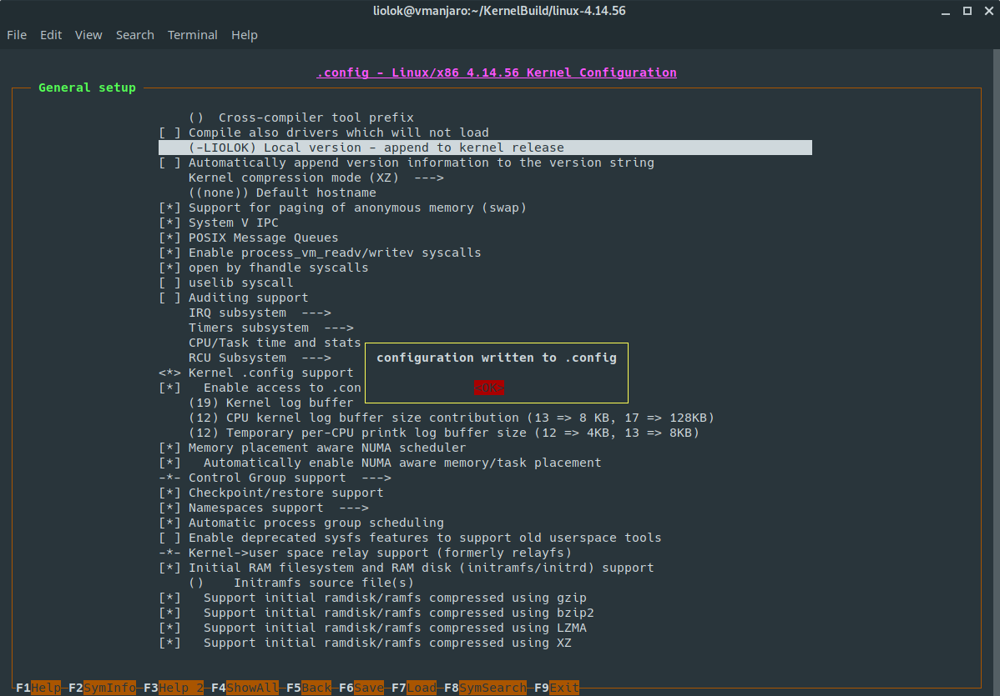
<center>上图: 保存成功退出配置</center>

## 编译内核

> 使用 `time` 命令可为编译计时;
> 
> 使用 `-jX` 选项可并行工作以加快编译, 其中 `X` 通常以 `线程数 + 1` 为优, 笔者在四核八线程的环境下使用 `-j9`.

```shell
$ time make -j9 # compile the kernel
```
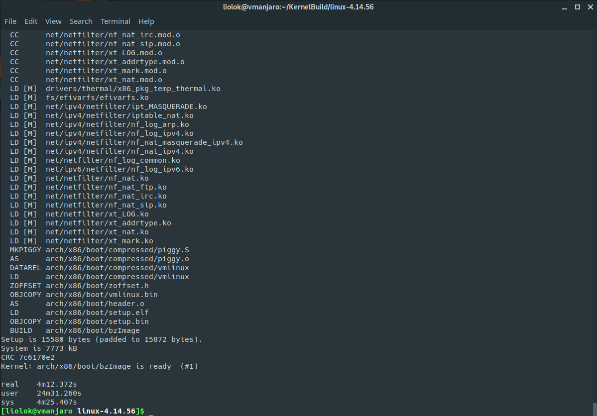
<center>内核编译成功示例</center>

可以看到只用了四分多钟, 说明合理使用 `-jX` 选项可以显著提高编译速度.

## 编译内核模块

> 注意! 接下来的步骤均需要以 root 身份进行操作, 使用 `su` 并输入 root 密码切换至 root , 命令以 `#` 开头而不是 `$`.

```shell
# make install_modules # compile the modules
```

## 复制内核到 /boot 目录

```shell
# cp -v arch/x86_64/boot/bzImage /boot/vmlinuz-linux414 # 64-bit kernel
```

> 此处的 `vmlinuz-linux414` 文件命名可以自行修改后缀如 `vmlinuz-linux414s` 或 `vmlinuz-linux-liolok`, 后续步骤中还会用到.

## 制作初始化内存盘

拷贝一份已有的 `mkinitcpio preset` 并加以修改, 便可用于生成对应内核的 initramfs 镜像.

```shell
# cp /etc/mkinitcpio.d/linux.preset /etc/mkinitcpio.d/linux414.preset # copy a preset
```

> 此处如果提示找不到 `linux.preset`, 可使用 `ls /etc/mkinitcpio.d` 查看实际文件名称.

```shell
# gedit /etc/mkinitcpio.d/linux414.preset # modify the preset copied
```

进行如下修改:

```
...
ALL_kver="/boot/vmlinuz-linux414"
...
default_image="/boot/initramfs-linux414.img"
...
fallback_image="/boot/initramfs-linux414-fallback.img"
```

最后, 为内核生成 initramfs 镜像.

```shell
# mkinitcpio -p linux414 # generate the initramfs images
```

## 复制 System.map

```shell
# cp System.map /boot/System.map-linux414
# ln -sf /boot/System.map-linux414 /boot/System.map # create a symlink
```

至此, 使用 `ls /boot` 检查, 应已新增以下 4 个文件和 1 个软符号链接:

- Kernel: vmlinuz-linux414
- Initramfs: initramfs-linux414.img 和 initramfs-linux414-fallback.img
- System Map: System.map-linux414
- System Map 符号链接

## 更新 grub 引导配置

```shell
# grub-mkconfig -o /boot/grub/grub.cfg # update grub configuration
```

重启系统后使用 `uname -a` 或 `uname -r` 可以看到内核版本已经更新.

# 添加系统调用

在刚刚编译的官方内核的基础上, 添加一个自定义的系统调用 `liolok_setnice` (前缀自拟), 功能如下:

- 实现对指定进程的 nice 值的修改/读取;
- 获取进程**最新**的优先级(priority).

为了添加系统调用, 要对此前的官方内核源码进行微量的修改:

```shell
$ cd ~/KernelBuild/linux-4.14.56 # kernel source code directory
$ gedit \
$ ./arch/x86/entry/syscalls/syscall_64.tbl \
$ ./include/uapi/asm-generic/unistd.h \
$ ./kernel/sys.c
```

## 修改系统调用表

系统调用表位于内核源码目录下的 `./arch/x86/entry/syscalls/syscall_64.tbl` 文件中:

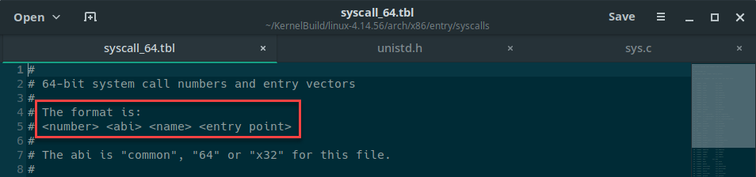
<center>系统调用表</center>

如上图所示, 系统调用表中每条记录的格式为:

```
<系统调用号> <common/64/x32> <系统调用名> <服务例程入口地址>
```

按该格式在列表末尾新增一条自定义的系统调用, 如下图:

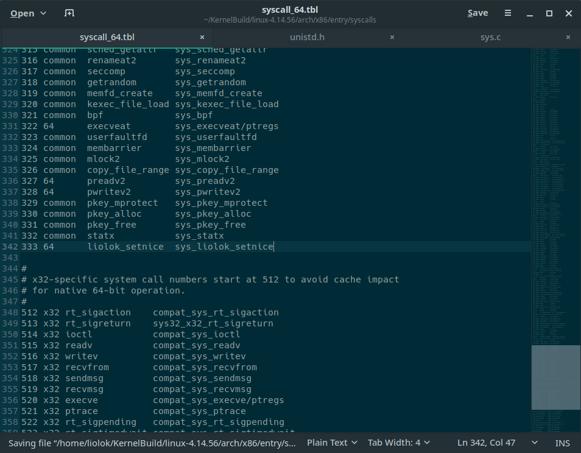
<center>新增系统调用表记录</center>

## 分配系统调用号

系统调用号位于 `./include/uapi/asm-generic/unistd.h` 文件中:

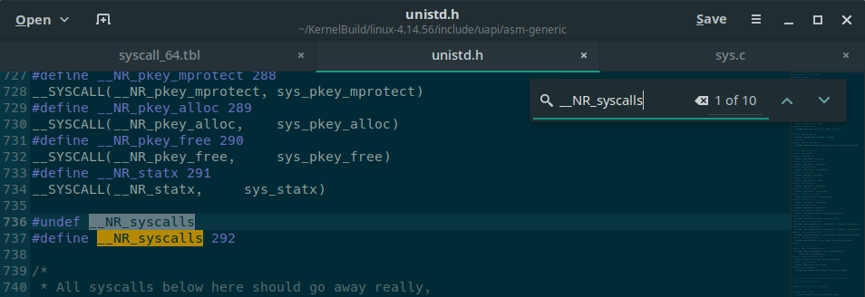
<center>系统调用号列表末尾</center>

在上图所示处按格式为新增的自定义系统调用分配号码:

> 注意增加 `__NR_syscalls` 的宏定义值.

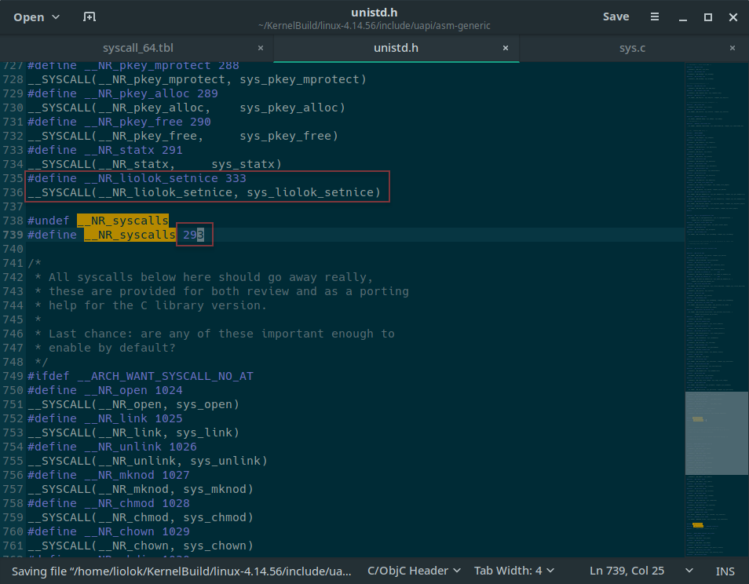
<center>分配系统调用号</center>

> 疑问: 为什么系统调用号以编号 `291` 结束而不是系统调用表中的 `332`?

## 实现服务例程

系统调用服务例程通常位于内核源码目录的 `./kernel/sys.c` 文件中:

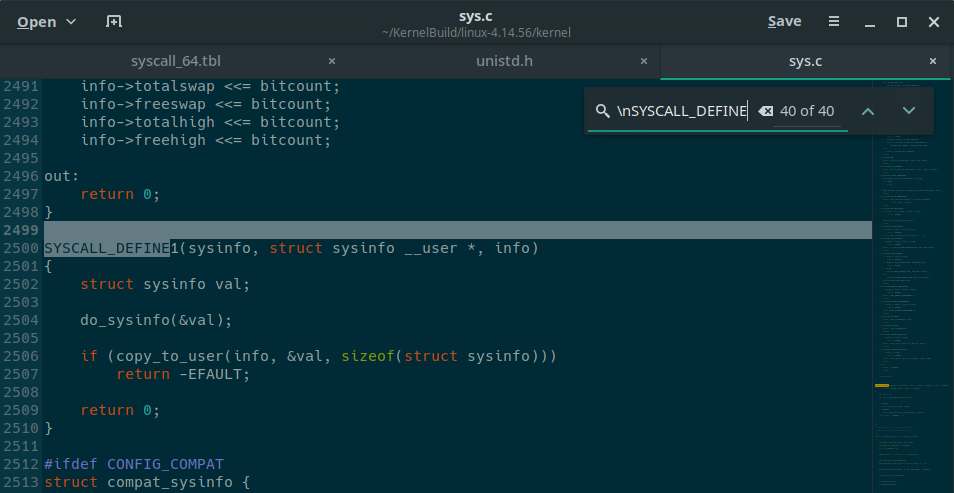
<center>服务例程列表末尾</center>

首先来看声明, 参数列表看起来有点奇怪, 这是因为 `SYSCALL_DEFINEN()` 是封装在 [`./include/linux/syscalls.h` (v4.14.56)](https://elixir.bootlin.com/linux/v4.14.56/source/include/linux/syscalls.h#L192) 的宏定义, 其中:
 
 - 左括号前的 `N` 取值范围为 [0, 6], 代表系统调用的参数个数;
 - 括号内第一个参数为系统调用名, 其后是成对出现的参数类型和参数名.
 
如上图中的 `SYSCALL_DEFINE1(sysinfo, struct sysinfo __user *, info)` 声明了名为 `sysinfo` 的系统调用, 其第一个也是唯一的参数是类型为 `struct sysinfo __user *` 的 `info`.

> 此处的 `__user` 也是一个宏定义, 位于 [`include/linux/compiler_types.h` (v4.14.56)](https://elixir.bootlin.com/linux/v4.14.56/source/include/linux/compiler_types.h#L7), 作为用户空间地址标识, 表示该指针不可直接解除引用(dereference), 同时也用于内核静态分析, 参见 StackOverflow 上的[这个回答](https://stackoverflow.com/a/38087885).

按此语法声明并定义所需的系统调用服务例程, 并加到列表末尾:

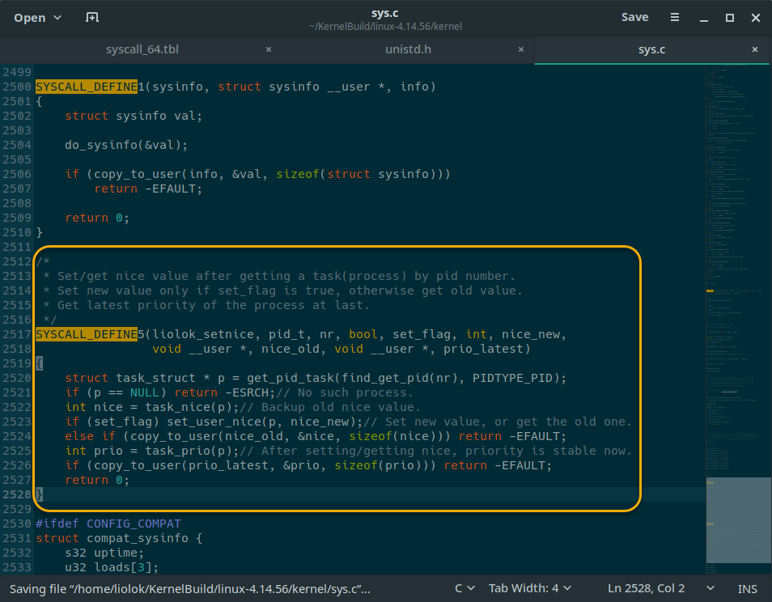
<center>实现并添加服务例程</center>

笔者的实现代码如下:

```C
/*
 * Set/get nice value after getting a task(process) by pid number.
 * Set new value only if set_flag is true, otherwise get old value.
 * Get latest priority of the process at last.
 */
SYSCALL_DEFINE5(liolok_setnice, pid_t, nr, bool, set_flag, int, nice_new,
                void __user *, nice_old, void __user *, prio_latest)
{
    struct task_struct * p = get_pid_task(find_get_pid(nr), PIDTYPE_PID);
    if (p == NULL) return -ESRCH;// No such process.
    int nice = task_nice(p);// Backup old nice value.
    if (set_flag) set_user_nice(p, nice_new);// Set new value, or get the old one.
    else if (copy_to_user(nice_old, &nice, sizeof(nice))) return -EFAULT;
    int prio = task_prio(p);// After setting/getting nice, priority is stable now.
    if (copy_to_user(prio_latest, &prio, sizeof(prio))) return -EFAULT;
    return 0;
}
```

### 原型参考

上面已经给出了声明的语法, 下面按类别给出这段代码实现中用到的内核中的各个原型:

#### 类型别名
| 名称 | 原型 |
| ---: | :--- |
| `pid_t` | [Linux source code: include/linux/types.h (v4.14.56) - Bootlin](https://elixir.bootlin.com/linux/v4.14.56/source/include/linux/types.h#L22) |

#### 枚举成员
| 名称 | 原型 |
| ---: | :--- |
| `PIDTYPE_PID` | [Linux source code: include/linux/pid.h (v4.14.56) - Bootlin](https://elixir.bootlin.com/linux/v4.14.56/source/include/linux/pid.h#L9) |

#### 结构体
| 名称 | 原型 |
| ---: | :--- |
| `pid` | [Linux source code: include/linux/pid.h (v4.14.56) - Bootlin](https://elixir.bootlin.com/linux/v4.14.56/source/include/linux/pid.h#L60) |
| `task_struct` | [Linux source code: include/linux/sched.h (v4.14.56) - Bootlin](https://elixir.bootlin.com/linux/v4.14.56/source/include/linux/sched.h#L559) |

#### 函数定义
| 名称 | 原型 |
| ---: | :--- |
| `find_get_pid()` | [Linux source code: kernel/pid.c (v4.14.56) - Bootlin](https://elixir.bootlin.com/linux/v4.14.56/source/kernel/pid.c#L489) |
| `get_pid_task()` | [Linux source code: kernel/pid.c (v4.14.56) - Bootlin](https://elixir.bootlin.com/linux/v4.14.56/source/kernel/pid.c#L477) |
| `task_nice()` | [Linux source code: include/linux/sched.h (v4.14.56) - Bootlin](https://elixir.bootlin.com/linux/v4.14.56/source/include/linux/sched.h#L1477) |
| `set_user_nice()` | [Linux source code: kernel/sched/core.c (v4.14.56) - Bootlin](https://elixir.bootlin.com/linux/v4.14.56/source/kernel/sched/core.c#L3776) |
| `task_prio()` | [Linux source code: kernel/sched/core.c (v4.14.56) - Bootlin](https://elixir.bootlin.com/linux/v4.14.56/source/kernel/sched/core.c#L3888) |
| `copy_to_user()` | [[Linux source code: include/linux/uaccess.h (v4.14.56) - Bootlin](https://elixir.bootlin.com/linux/v4.14.56/source/include/linux/uaccess.h#L152) |

#### 错误码宏定义
| 名称 | 原型 |
| ---: | :--- |
| `ESRCH` | [Linux source code: include/uapi/asm-generic/errno-base.h (v4.14.56) - Bootlin](https://elixir.bootlin.com/linux/v4.14.56/source/include/uapi/asm-generic/errno-base.h#L7) |
| `EFAULT` | [Linux source code: include/uapi/asm-generic/errno-base.h (v4.14.56) - Bootlin](https://elixir.bootlin.com/linux/v4.14.56/source/include/uapi/asm-generic/errno-base.h#L18) |

## 重新编译内核

将添加了系统调用的内核源码重新编译, 从而运行该系统调用. 具体步骤应从[清理编译历史](#清理编译历史)开始.

## 测试系统调用

编写一个用户态程序以测试新添加的系统调用, 如笔者的 `TestSyscall.c` 代码如下:

```C
#include <sys/syscall.h> // syscall()
#include <unistd.h> // pid_t, getpid()
#include <stdio.h> // scanf(), printf()

#define __NR_liolok_setnice 333 // syscall name and number

int main(void)
{
    printf("[ Test program for syscall liolok_setnice ]\n");
    printf("-------------------------------------------\n");
    printf("Will test on this process itself by default\n");
    printf("or anohter process (need input process id).\n");
    printf("-------------------------------------------\n");
    printf(":: Test on this process itself? [y/n]");
    pid_t nr; // pid number
    char choice; scanf("%c%*c", &choice); // choose process to test
    if (choice != 'y') { printf(":: Process ID: "); scanf("%d", &nr); }
    else { nr = getpid(); printf("\nProcess ID:\t%d\n", nr); } // default
    choice = 'g'; printf("Original values:\n");
    int nice, prio, err, n = 1;
    do {
        int set_flag = (choice != 'g');
        if (set_flag) { printf(":: New nice [-20, 19]"); scanf("%d%*c", &nice); }
        err = syscall(__NR_liolok_setnice, nr, set_flag, nice, &nice, &prio);
        if (err) { printf("Error %d, test terminated.\n", err); return err; }
        else if (!set_flag) printf("Nice:\t\t%d\n", nice); // got nice value
        printf("Priority:\t%d\n", prio); // show latest priority
        printf("\n%d-th test to see latest values:\n", n++);
        printf(":: Set/get nice value? (Ctrl+C to exit) [s/g]");
    } while (scanf("%c%*c", &choice) != EOF);
}
```

在终端下编译运行并进行测试, 结果如下:

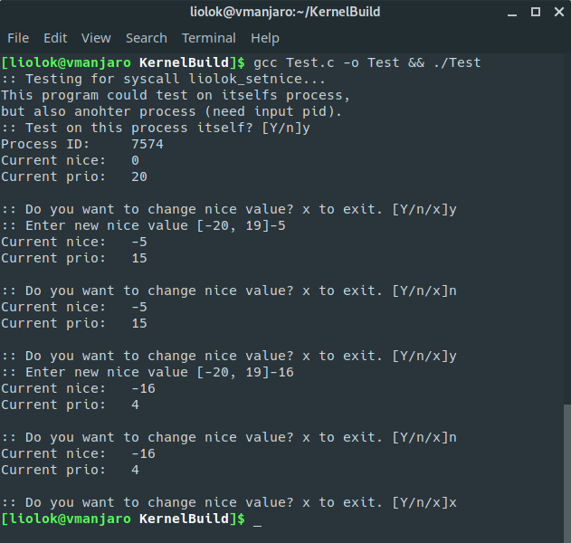
<center>运行程序测试系统调用</center>

从测试结果中可以看出:
- 进程的 `nice` 和 `prio` 默认值分别为 `0` 和 `20`, 两者的关系是 `nice` + `prio` = `20`, 参见 [Linux source code: include/linux/sched/prio.h (v4.14.56) - Bootlin](https://elixir.bootlin.com/linux/v4.14.56/source/include/linux/sched/prio.h);
- 超出定义范围的设定不会改变 `nice` 值, 这是因为在调用的 `set_user_nice()` 中对参数值进行了[检验](https://elixir.bootlin.com/linux/v4.14.56/source/kernel/sched/core.c#L3783), 当其超出范围时将会直接返回, 而不会对继续进行操作.


