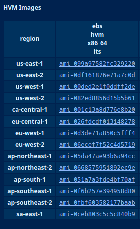
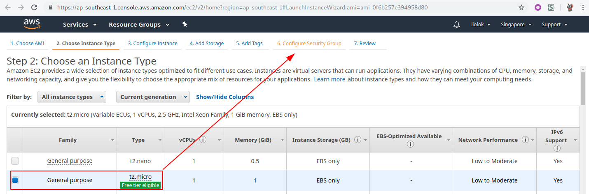
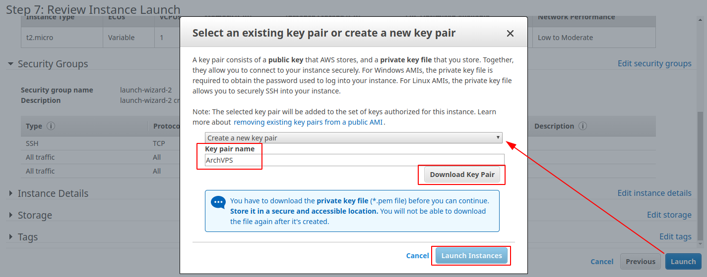
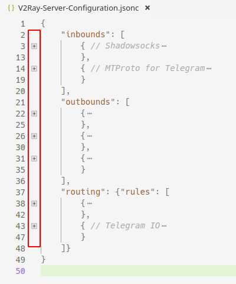

# 注册 AWS 账户

> 注册账户需要一张信用卡，AWS 支持以下类型：


https://portal.aws.amazon.com/billing/signup

*AWS 账户包含 12 个月的免费套餐访问权限，包括使用 Amazon EC2、Amazon S3 和 Amazon DynamoDB。*

在这篇文章中，我们会创建一个运行 [Arch Linux][0] 的 EC2 实例，并使用 [V2Ray][1] 搭建 Shadowsocks + MTProto 服务端。

[0]: <https://www.archlinux.org/>
[1]: <https://www.v2ray.com/en/index.html> "Project V · Project V"

> 提供免费一年 VPS 服务的不只有 Amazon，还有 Google 甚至更多。或许将来我会追加这部分内容。

<!-- more -->

# 创建 EC2 实例

## 选择实例镜像

访问[这个链接][2]（来自 [ArchWiki][3]），根据地区选择一个镜像。



[2]: https://www.uplinklabs.net/projects/arch-linux-on-ec2/
[3]: <https://wiki.archlinux.org/index.php/Arch_Linux_AMIs_for_Amazon_Web_Services> "Arch Linux AMIs for Amazon Web Services - ArchWiki"

比如说如果你想要一个所在地为新加坡的实例，那么就选择 `ap-southeast-1` 或者 `ap-southeast-2`。点击对应的 "ami-xxxx" 链接以继续。

## 选择实例类型



只有一个免费的类型所以实际上我们并没有什么选择，直接跳到第六步。

## 添加流量规则


> 我不了解“允许来自任何地方的所有流量”会有多么不安全。如果你在意安全性，请阅读官方文档并做出相应的改动。

## 下载密钥文件并启动实例



这个名为 `ArchVPS.pem` 的密钥文件非常重要，我们将它下载至 `~/.ssh/ArchVPS.pem` 或者其他安全、不易被清除的位置。

## 连接实例

我们可以在这里查看并管理实例：


现在我们获取到了实例的 IP 地址，运行这条命令以连接：

> Windows 用户可能会需要用到 [PuTTY][4] 或类似的工具。

```shell
$ ssh -i ~/.ssh/ArchVPS.pem root@在这.输入.实例.IP
```

[4]: <https://www.putty.org/> "Download PuTTY - a free SSH and telnet client for Windows"

如果收到以下警告，需运行 `chmod 400 ~/.ssh/ArchVPS.pem` 并重试。

```shell
@@@@@@@@@@@@@@@@@@@@@@@@@@@@@@@@@@@@@@@@@@@@@@@@@@@@@@@@@@@
@         WARNING: UNPROTECTED PRIVATE KEY FILE!          @
@@@@@@@@@@@@@@@@@@@@@@@@@@@@@@@@@@@@@@@@@@@@@@@@@@@@@@@@@@@
Permissions 0644 for '.ssh/ArchVPS.pem' are too open.
It is required that your private key files are NOT accessible by others.
This private key will be ignored.
Load key ".ssh/ArchVPS.pem": bad permissions
root@*.*.*.*: Permission denied (publickey).
```

如果显示以下内容，只需输入 yes 让 SSH 记住这个主机即可。

```shell
The authenticity of host '*.*.*.* (*.*.*.*)' can't be established.
ECDSA key fingerprint is SHA256:blablabla.
Are you sure you want to continue connecting (yes/no)? yes
Warning: Permanently added '*.*.*.*' (ECDSA) to the list of known hosts.
```

现在你应该已经以 root 身份登录实例了，运行 `pacman -Syyuu` 并在更新系统后重启。

# 搭建基于 V2Ray 的 SS + MTProto 服务端

## 配置

请下载这个不到 50 行的[配置文件模板](./使用-AWS-免费搭建-SS-MTProto-服务端/V2Ray-服务端配置.jsonc "V2Ray-服务端配置.jsonc")并使用靠谱的编辑器打开。比如在 VS Code 中，将语言模式切换至 "JSON with Comments"，并使用块折叠功能来更好地理解配置文件的层次结构。



以下是配置模板里 `inbounds` 部分中你需要了解的内容，在客户端配置中也会用到：

- Shadowsocks
    - port：端口
    - settings
        - method：加密方式
        - **password**：密码
- MTProto for Telegram
    - port：端口
    - settings -> users -> **secret**：用户密钥

所有其他的值都可以保持不变，除了下面这两个，你需要自行将其补充完整：

- 写出/生成 Shadowsocks 的密码, 建议不少于 16 个字符；
- 生成 MTProto 的用户密钥, 可以在本地或者 Arch VPS 实例上运行 `openssl rand -hex 16` 生成。

现在你已经得到了一份完整且唯一的配置文件。连接实例，运行以下命令，将实例中的默认配置更改为你的配置。

```shell
# pacman -S v2ray # 安装 V2Ray
# cd /etc/v2ray # 切换到 V2Ray 配置文件所在目录
# mv -v config.json config.json.origin # 备份原配置文件
# nano config.json # 编辑全新的配置文件
```

在编辑器 nano 中，通过右键菜单或者其他任何方式粘贴你的配置内容，按 `Ctrl + O` 和 `Enter` 进行保存，按 `Ctrl + X` 退出编辑。

## 服务

```shell
# systemctl enable v2ray.service
# systemctl start v2ray.service
```

现在服务应该已经在运行了，如果想要检查运行状态，可以使用命令 `systemctl status v2ray.service`。
