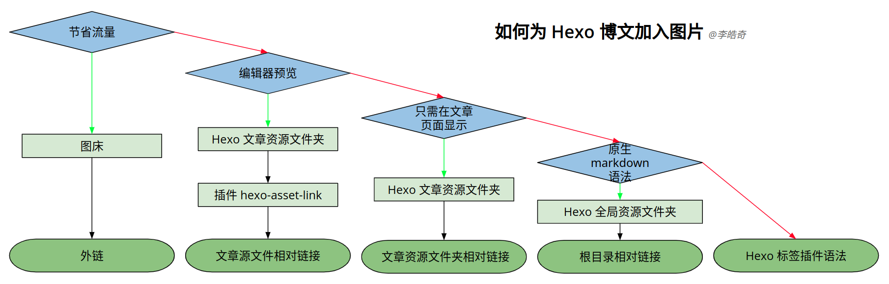
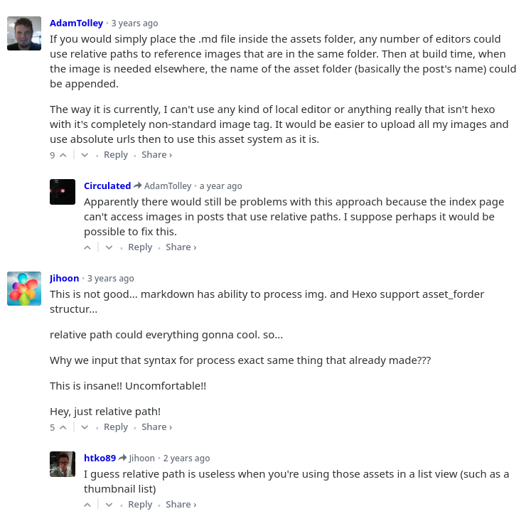

使用 markdown 添加图片很简单。语法是这样：``，其中：

- `alt` 是替代文本，当用户由于连接问题、路径错误，或者使用屏幕阅读器等原因无法看到图片时为其提供替代的信息；
- `path` 是图片文件路径，也是最重要的部分；
- `title` 是提示文本（可选），当光标停留在图片上时会浮现出来。

这篇文章中我将会主要讨论图片文件路径或者说链接。如果需要在不同的方案中快速地做出选择，可以参考下面的流程图并直接跳转到相应部分。



<!-- more -->

# 图床

图床是流行的说法，指图片托管服务。有很多网站提供这类服务：上传一个图片文件，然后你会得到它的链接，甚至直接是 markdown 代码。下面的链接以 [SM.MS][smms] 为例演示外链：

[smms]: https://sm.ms/ "Simple Free Image Hosting - SM.MS - Simple Free Image Hosting"

## 外链

```md

```


在此之上，你甚至可以找到编辑器或者插件，来做到在拖放或粘贴图片后自动上传并插入 markdown 代码。

> 如果需要节省博客站点的流量，使用图床或许是个很好的选择。但如果你在使用 GitHub Pages 之类的静态站点托管服务，并且没有那么多的文章和图片，那么完全没有必要节省流量。

# Hexo 文章资源文件夹

首先，这个特性需要在 Hexo 站点配置文件中开启：

```yml _config.yml
post_asset_folder: true
```

然后 `source/_posts` 下的目录结构会变成这样：

```plain source/_posts/
2019-02-14-测试文章.md
2019-02-14-测试文章/
+-- 测试图片-1.png
+-- 测试图片-2.png
+-- 子目录/
|   +-- 测试图片-3.png
|   +-- 测试图片-4.png
```

可以看到，文章资源文件夹就在源文件一旁，且与其同名。

## 文章源文件相对链接

首先需要安装插件 [`hexo-asset-link`](https://www.npmjs.com/package/hexo-asset-link)：

```shell
$ npm i --save hexo-asset-link
```

然后在源文件中，相对链接的写法是这样：

```md source/_posts/2019-02-14-测试文章.md


```

## 文章资源文件夹相对链接

```md source/_posts/2019-02-14-测试文章.md


```

> 这类相对链接只会在文章页面上起作用，在首页摘要和编辑器预览中不行。

# Hexo 全局资源文件夹

对于图片，可以是 `source/images` 或者 `source/img` 等等。比如我将站点的图标文件放入 `source/images/sakamoto/`：

## 根目录相对链接

> 确保链接以斜杠‘/’开头

```md

```


> 根目录相对链接只会在 Hexo 站点内起作用，在编辑器预览中基本上不行。

# Hexo 标签插件语法

这是关于这个方案的官方[文档](https://hexo.io/zh-cn/docs/asset-folders.html#相对路径引用的标签插件 "相对路径引用的标签插件")，我甚至不想在自己的博客里写出来。这里是英文版文档页面下放的最热评论：


