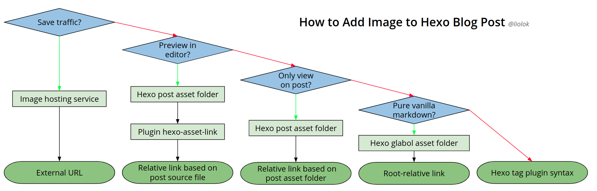
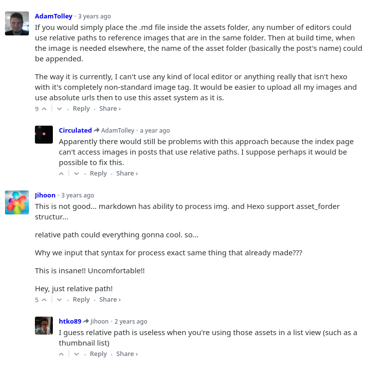

Adding an image is supposed to be easy in markdown. Syntax is like: ``, in which:

- `alt` is alternate text, provides alternative information for the image if user cannot view it for some reason like slow connection, wrong path or user is using screen reader;
- `path` is image file link, most important part;
- `title` is tooltip text (optional), appears when cursor is floating over the image.

In this article I will mainly talk about the image file path or link or whatever you name it. But if you want to make a quick choice in different solutions, follow the map below and jump to the section directly.



<!-- more -->

# Image Hosting Sevice

*"An image hosting service allows individuals to upload images to an Internet website. The image host will then store the image onto its server, and show the individual different types of code to allow others to view that image."* － [Wikipedia](https://en.wikipedia.org/wiki/Image_hosting_service "Image hosting service - Wikipedia")

There are websites providing this type of sevice: You upload an image file, then get the link of it, or even its markdown code directly.

## External URL

```md

```


In addition, you could even find editors or plugins, that will do the uploading work and insert markdown code automatically after you drag&drop or paste the image.

> If you need to save the traffic of your blog site, an image hosting service may be a nice choice. However if you're already using a static site hosting service like GitHub Pages, and don't have that many posts and images, there is no need to save traffic at all.

# Post Asset Folder

First of all, this feature need to be enabled in Hexo site configuration file:

```yml _config.yml
post_asset_folder: true
```

Then the files in `source/_posts` should look like this:

```plain source/_posts/
2019-02-14-Test-Post.md
2019-02-14-Test-Post/
+-- Test-Image-1.png
+-- Test-Image-2.png
+-- Subdirectory/
|   +-- Test-Image-3.png
|   +-- Test-Image-4.png
```

You can see that post asset folder is besides the post source file, and has the same name with it.

## Relative Link Based on Post Source File

First you need to install plugin [`hexo-asset-link`](https://www.npmjs.com/package/hexo-asset-link):

```shell
$ npm i --save hexo-asset-link
```

Then in markdown source file, the base-relative links scheme would look like this:

```md source/_posts/2019-02-14-Test-Post.md


```

## Relative Link Based on Post Asset Folder

```md source/_posts/2019-02-14-Test-Post.md


```

> This type of base-relative link would only works on post page, not on home page excerption or editor preview.

# Global Asset Folder

For images it could be `source/images` or `source/img` or something similiar. For example I put my site favison into `source/images/sakamoto/`:

## Root-relative Link

Pay attention to the first slash '/', without it the link would be a base-relative one.

```md

```


> This type of root-relative link works in blog site, but basically not in editor preview.

# Hexo Tag Plugin Syntax

Here is the official [documentation](https://hexo.io/docs/asset-folders#Tag-Plugins-For-Relative-Path-Referencing "Tag Plugins For Relative Path Referencing") about this solution, I don't even want to write it down in my own blog. Here are top comments right below the docs:


