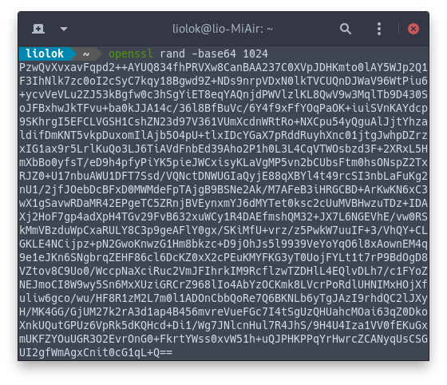

V2Ray core doesn't provide subscription feature, this is cool because it's considered unnecessery to people who self-host just one or several V2Ray services. If using service bought from websites, however, one may have to find a client with subscribe support to get a better user experience.

Up to now, there are several subscription formats; I'm gonna explore to resolve some of them on my own demand, using Python or even other languages.

<!-- more -->

# [V2RayN Format][v2rayn-format]

- Subscription url: a regular url (http / https);
- Return content of subscription url: a list of [share link][v2rayn-share-link], separated by newline, at last encoded using `Base64`;
- Support schemes: `vmess`, `ss` and `socks`.

[v2rayn-format]: https://github.com/2dust/v2rayN/wiki/订阅功能说明 "订阅功能说明 · 2dust/v2rayN Wiki"
[v2rayn-share-link]: https://github.com/2dust/v2rayN/wiki/分享链接格式说明(ver-2) "分享链接格式说明(ver 2) · 2dust/v2rayN Wiki"

Example:

```
vmess://base64(Configuration)
ss://base64(Configuration)
socks://base64(Configuration)
```

## Get Content from Subscription Url

> [HOWTO Fetch Internet Resources Using The urllib Package — Python 3.8.0 documentation](https://docs.python.org/3/howto/urllib2.html#fetching-urls "HOWTO Fetch Internet Resources Using The urllib Package — Python 3.8.0 documentation")

```py
from urllib.request import urlopen
subscribe_url = 'https://input-your-own-v2rayn-format-subscribe-url-here'
return_content = urlopen(subscribe_url).read()
print(return_content)
```

Now we should get a really long string that seems random, like this:



## Get Share Links

> [base64 — Base16, Base32, Base64, Base85 Data Encodings — Python 3.8.0 documentation](https://docs.python.org/3/library/base64.html?highlight=base64#base64.b64decode "base64 — Base16, Base32, Base64, Base85 Data Encodings — Python 3.8.0 documentation")

```py
from base64 import b64decode
share_links = b64decode(return_content).decode('utf-8').splitlines()
print(share_links)
```

This step we get a list of share link string:


## Get Configurations

> [urllib.parse — Parse URLs into components — Python 3.8.0 documentation](https://docs.python.org/3/library/urllib.parse.html#urllib.parse.urlsplit "urllib.parse — Parse URLs into components — Python 3.8.0 documentation")

> [json — JSON encoder and decoder — Python 3.8.0 documentation](https://docs.python.org/3/library/json.html#json.loads "json — JSON encoder and decoder — Python 3.8.0 documentation")

```py
from urllib.parse import urlsplit
import json
schemes_allow = ['vmess', 'ss', 'socks']
configs = []
for share_link in share_links:
    url = urlsplit(share_link)
    if url.scheme not in schemes_allow: raise RuntimeError('invalid share link')
    configs.append(json.loads(b64decode(url.netloc).decode('utf-8')))
print(configs)
```

Finally we get a list of json objects, each of them contains a server configuraion:


