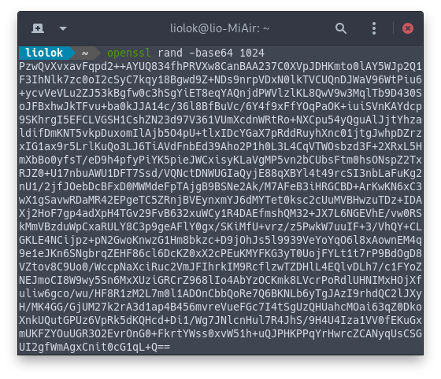
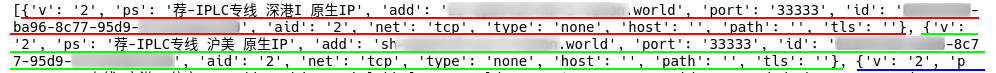

V2Ray 核心并不提供订阅功能，问题不大，对于单节点或几个节点的自建用户来说基本没什么用。但如果是机场用户，就需要找一个支持订阅的客户端才能有更好的用户体验。

目前为止，存在好几种订阅格式；我会按自己的需求，探索如何使用 Python 或者其他语言来解析其中几种。

<!-- more -->

# [V2RayN 格式][v2rayn-format]

- 订阅链：一个普通的 url（http / https）；
- 订阅链接返回内容：一个 [分享链接][v2rayn-share-link] 的集合，以换行分割，最后使用 `Base64` 编码；
- 支持协议：`vmess`、`ss`、`socks`。

[v2rayn-format]: https://github.com/2dust/v2rayN/wiki/订阅功能说明 "订阅功能说明 · 2dust/v2rayN Wiki"
[v2rayn-share-link]: https://github.com/2dust/v2rayN/wiki/分享链接格式说明(ver-2) "分享链接格式说明(ver 2) · 2dust/v2rayN Wiki"

示例：

```
vmess://base64(Configuration)
ss://base64(Configuration)
socks://base64(Configuration)
```

## 获取订阅链接内容

> [HOWTO Fetch Internet Resources Using The urllib Package — Python 3.8.0 documentation](https://docs.python.org/3/howto/urllib2.html#fetching-urls "HOWTO Fetch Internet Resources Using The urllib Package — Python 3.8.0 documentation")

```py
from urllib.request import urlopen
subscribe_url = 'https://input-your-own-v2rayn-format-subscribe-url-here'
return_content = urlopen(subscribe_url).read()
print(return_content)
```

应该得到一个极其长、看似随机的字符串，像下面这样：



## 获取分享链接列表

> [base64 — Base16, Base32, Base64, Base85 Data Encodings — Python 3.8.0 documentation](https://docs.python.org/3/library/base64.html?highlight=base64#base64.b64decode "base64 — Base16, Base32, Base64, Base85 Data Encodings — Python 3.8.0 documentation")

```py
from base64 import b64decode
share_links = b64decode(return_content).decode('utf-8').splitlines()
print(share_links)
```

这一步我们得到一个字符串列表，一堆分享链接：


## 获取节点配置列表

> [urllib.parse — Parse URLs into components — Python 3.8.0 documentation](https://docs.python.org/3/library/urllib.parse.html#urllib.parse.urlsplit "urllib.parse — Parse URLs into components — Python 3.8.0 documentation")

> [json — JSON encoder and decoder — Python 3.8.0 documentation](https://docs.python.org/3/library/json.html#json.loads "json — JSON encoder and decoder — Python 3.8.0 documentation")

```py
from urllib.parse import urlsplit
import json
schemes_allow = ['vmess', 'ss', 'socks']
configs = []
for share_link in share_links:
    url = urlsplit(share_link)
    if url.scheme not in schemes_allow: raise RuntimeError('invalid share link')
    configs.append(json.loads(b64decode(url.netloc).decode('utf-8')))
print(configs)
```

最后，我们得到一个 json 对象列表，其中每一个都包含一个节点配置：


